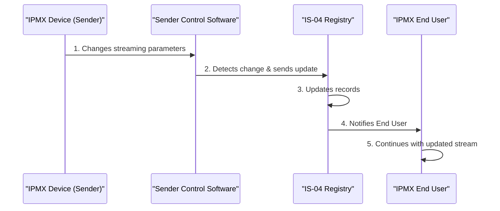

# Use Case: Dynamic Update of NMOS Flow Connection Parameters in IPMX Deployments

## Document Information

- **Document Title:** Dynamic Update of Connection Parameters in IS-04 Registry
- **Document Owner:** [Owner's Name]
- **Version:** 1.0
- **Status:** Draft
- **Date:** YYYY-MM-DD

## 1. Brief Description

This use case outlines the process for dynamically updating connection parameters (e.g., framerate, bits-per-pixel) of an ongoing dynamic media stream in the IS-04 registry. This allows for changes of media parameters without the need to break down and re-establish the connection, thereby minimizing unnecessary network traffic and preventing the thrashing of applications that monitor or control the NMOS deployment.

## 2. Actors

- **IPMX End User:** Utilizes the IPMX deployment for media streaming.
- **IPMX Device (Sender):** The source device broadcasting the media stream.
- **IS-04 Registry:** Maintains a registry of devices and their connection parameters.

## 3. Pre-Conditions

- The NMOS environment is fully operational, with an IS-04 Registry operational.
- At least one IPMX device (sender) is actively streaming media with specified connection parameters.
- IPMX End Users have applications monitoring or controlling the IPMX deployment.

## 4. Basic Flow

1. The IPMX device (sender) changes its media streaming parameters (e.g., switches from 780P to 1280P).
2. The change is detected by the sender device's control software.
3. The IPMX device (sender) sends an update to the IS-04 Registry with the new connection parameters.
4. The IS-04 Registry updates its records to reflect the new parameters without requiring the connection to be re-established.
5. IPMX End Users' monitoring or control applications receive updated connection information from the IS-04 Registry seamlessly.
6. The media stream continues with the updated parameters without interruption or degradation of service.

## 5. Alternate/Exception Flows

- **4a. Update Failure:** If the IS-04 Registry cannot update the connection parameters:
    1. The Registry logs the error and sends an alert to the IPMX End User.
    2. The IPMX device (sender) attempts to resend the updated parameters.
    3. If repeated attempts fail, manual intervention is requested to resolve the issue.

## 6. Post Conditions

- The IPMX device's connection parameters in the IS-04 Registry are updated to reflect the current streaming parameters.
- IPMX End Users' applications reflect the updated connection parameters without experiencing downtime or requiring reconfiguration.

## 7. Supplemental Requirements

- **Real-Time Updates:** The system must support real-time updates to connection parameters with minimal latency.
- **Error Handling:** Robust error handling mechanisms for update failures, ensuring reliability and system stability.

## 8. Visual Model

## Corresponding Steps Table

| Step | Description |
|------|-------------|
| 1 | The NMOS device (sender) initiates a change in streaming parameters, such as resolution. |
| 2 | The sender's control software detects this change and communicates it to the IS-04 Registry. |
| 3 | The IS-04 Registry updates its records to reflect the new parameters. |
| 4 | The IS-04 Registry notifies the end user of the update. |
| 5 | The end user's applications adapt to the new streaming parameters, ensuring continuous operation. |

## 9. Revision History

| Version | Date       | Author          | Description                                          | Status |
|---------|------------|-----------------|------------------------------------------------------|--------|
| 1.0     | YYYY-MM-DD | [Author's Name] | Initial creation of the use case for dynamic configuration of NMOS connections. | Draft  |

