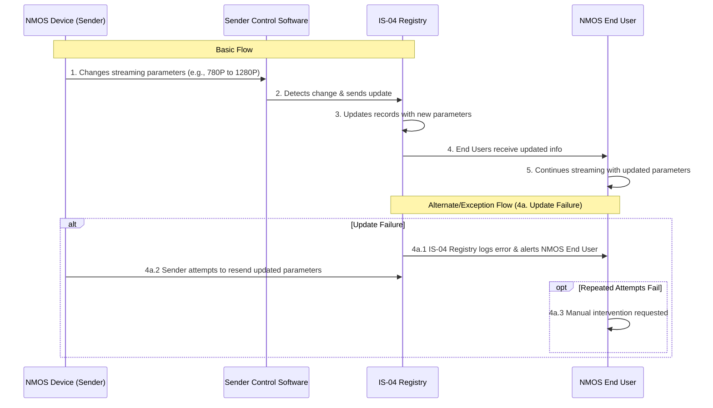

# Use Case: Dynamic Update of Connection Parameters in NMOS Deployments

## Document Information

- **Document Title:** Dynamic Update of Connection Parameters in IS-04 Registry
- **Document Owner:** [Owner's Name]
- **Version:** 1.0
- **Status:** Draft
- **Date:** [February 16, 2024]

## 1. Brief Description

This use case outlines the process for dynamically updating connection parameters (e.g., framerate, bits-per-pixel) of an ongoing media stream in the IS-04 registry of an NMOS deployment. The goal is to ensure these updates do not necessitate breaking down and re-establishing the connection, thereby minimizing unnecessary network traffic and preventing the thrashing of applications monitoring or controlling the NMOS deployment.

## 2. Actors

- **NMOS End User:** Utilizes the NMOS deployment for media streaming.
- **NMOS Device (Sender):** The source device broadcasting the media stream.
- **IS-04 Registry:** Maintains a registry of devices and their connection parameters.

## 3. Pre-Conditions

- An NMOS deployment is operational with an active IS-04 Registry.
- At least one NMOS device (sender) is actively streaming media with specified connection parameters.
- NMOS End Users have applications monitoring or controlling the NMOS deployment.

## 4. Basic Flow

1. The NMOS device (sender) changes its media streaming parameters (e.g., switches from 780P to 1280P).
2. The change is detected by the sender device's control software.
3. The NMOS device (sender) sends an update to the IS-04 Registry with the new connection parameters.
4. The IS-04 Registry updates its records to reflect the new parameters without requiring the connection to be re-established.
5. NMOS End Users' monitoring or control applications receive updated connection information from the IS-04 Registry seamlessly.
6. The media stream continues with the updated parameters without interruption or degradation of service.

## 5. Alternate/Exception Flows

- **4a. Update Failure:** If the IS-04 Registry cannot update the connection parameters:
    1. The Registry logs the error and sends an alert to the NMOS End User.
    2. The NMOS device (sender) attempts to resend the updated parameters.
    3. If repeated attempts fail, manual intervention is requested to resolve the issue.

## 6. Post Conditions

- The NMOS device's connection parameters in the IS-04 Registry are updated to reflect the current streaming parameters.
- NMOS End Users' applications reflect the updated connection parameters without experiencing downtime or requiring reconfiguration.

## 7. Supplemental Requirements

- **Real-Time Updates:** The system must support real-time updates to connection parameters with minimal latency.
- **Error Handling:** Robust error handling mechanisms for update failures, ensuring reliability and system stability.

## 8. Visual Model

## Use Case Steps Table

| Step | Action | Description |
|------|--------|-------------|
| 1    | Change Parameters | The NMOS device (sender) changes its media streaming parameters, such as switching from 780P to 1280P. |
| 2    | Detect Change | The change is detected by the sender device's control software. |
| 3    | Send Update | The NMOS device (sender) sends an update to the IS-04 Registry with the new connection parameters. |
| 4    | Update Records | The IS-04 Registry updates its records to reflect the new parameters without requiring the connection to be re-established. |
| 5    | Notify End Users | NMOS End Users' monitoring or control applications receive updated connection information from the IS-04 Registry seamlessly. |
| 6    | Continue Streaming | The media stream continues with the updated parameters without interruption or degradation of service. |

## Alternate/Exception Flows

| Step | Action | Description |
|------|--------|-------------|
| 4a.1 | Log Error & Alert | If the IS-04 Registry cannot update the connection parameters, it logs the error and sends an alert to the NMOS End User. |
| 4a.2 | Attempt Resend | The NMOS device (sender) attempts to resend the updated parameters. |
| 4a.3 | Request Manual Intervention | If repeated attempts fail, manual intervention is requested to resolve the issue. |

## Revision History

| Version | Date       | Author          | Description                                  | Status  |
|---------|------------|-----------------|----------------------------------------------|---------|
| 1.0     | [Insert Date] | [Author's Name] | Initial creation of the Dynamic Update use case. | Draft   |
|         |              |                 |                                              |         |
|         |              |                 |                                              |         |

