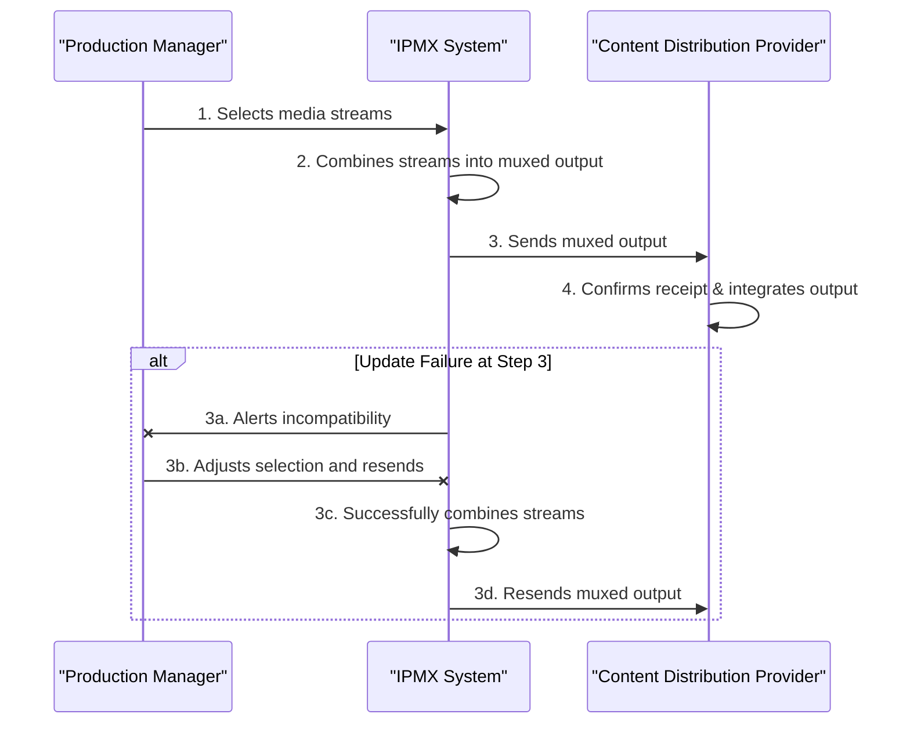

# Use Case: Selection of Multiple Media Streams for Muxed Output in IPMX Production

## Document Information

- **Document Title:** Selection of Media Streams for Muxed Output
- **Document Owner:** [Owner's Name]
- **Version:** 1.0
- **Status:** Draft
- **Date:** February 20, 2024

## 1. Brief Description

This use case describes the process whereby an IPMX production facility selects several of its media streams to be combined into a single muxed output. This output is then sent to a content distribution provider, facilitating efficient broadcast or streaming. The objective is to enable the seamless selection and combination of media streams, ensuring compatibility and optimal quality for the content distribution.

## 2. Actors

- **Production Manager:** Oversees the selection of media streams for broadcasting.
- **IPMX System:** Manages the media streams and the muxing process.
- **Content Distribution Provider:** Receives the muxed output for further distribution.

## 3. Pre-Conditions

- The IPMX production facility has multiple active media streams available for selection.
- The IPMX system is configured to support muxing of selected media streams.
- The content distribution provider is ready to receive the muxed output stream.

## 4. Basic Flow

1. The Production Manager identifies which media streams are to be included in the muxed output.
2. The Production Manager inputs the selection into the IPMX System.
3. The IPMX System dynamically combines the selected media streams into a single muxed output.
4. The muxed output is formatted according to the specifications required by the Content Distribution Provider.
5. The IPMX System sends the muxed output to the Content Distribution Provider.
6. The Content Distribution Provider confirms receipt of the muxed output and integrates it into their distribution workflow.

## 5. Alternate/Exception Flows

- **3a. Incompatibility Issue:** If selected media streams are incompatible for muxing:
    1. The IPMX System alerts the Production Manager of the incompatibility.
    2. The Production Manager adjusts the selection to resolve the issue.
    3. The process resumes at step 3.

## 6. Post Conditions

- The selected media streams have been successfully combined into a single muxed output.
- The Content Distribution Provider has received and integrated the muxed output into their distribution channels.

## 7. Supplemental Requirements

- **Compatibility Checking:** The IPMX System must include functionality to check compatibility among selected media streams for muxing.
- **Quality Assurance:** Measures are in place to ensure the muxed output meets the quality standards required by the Content Distribution Provider.

## 8. Visual Model


### Corresponding Steps Table

| Step | Description |
|------|-------------|
| 1    | The Production Manager selects which media streams to include in the muxed output. |
| 2    | The IPMX System combines the selected media streams into a muxed output. |
| 3    | The IPMX System sends the muxed output to the Content Distribution Provider. |
| 4    | The Content Distribution Provider confirms receipt of the muxed output and integrates it into their distribution workflow. |
| 3a   | **Alternate Flow:** If there's an incompatibility issue preventing the muxed output from being accepted, the IPMX System alerts the Production Manager. |
| 3b   | The Production Manager adjusts the selection to resolve the incompatibility and resends the information. |
| 3c   | The IPMX System successfully combines the adjusted streams into a new muxed output. |
| 3d   | The IPMX System resends the corrected muxed output to the Content Distribution Provider. |
```

## 9. Revision History

| Version | Date       | Author          | Description                                          | Status |
|---------|------------|-----------------|------------------------------------------------------|--------|
| 1.0     | February 20, 2024 | Randy Godwin | Initial creation of use case for selecting media streams for muxed output in IPMX production, including adjustments for alternate flow scenarios. | Draft  |
