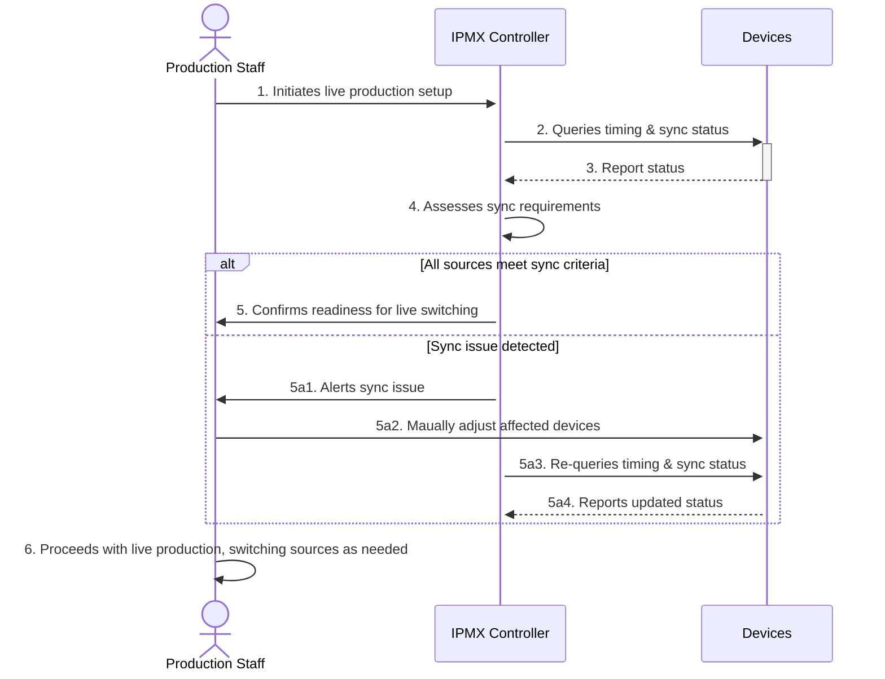

# Use Case: IPMX Live Production Switching

## Document Information

- **Document Title:** Live Production Switching Synchronization
- **Document Owner:** []
- **Version:** 1.0
- **Status:** Draft
- **Date:** [February 16 2024]

## 1. Brief Description

This use case describes the process of synchronizing multiple video and audio sources for seamless live switching in a production environment. It starts when the production is set up and ends when all sources are synchronized and ready for live switching.  

## 2. Actors

- **Production Staff:** Individuals responsible for managing and executing the live production.
- **IPMX Controller:** The system used to manage IPMX device connections and synchronization.

## 3. Pre-Conditions

- The production staff has logged into the IPMX Controller system.
- Video and audio sources are connected to the IPMX Controller.
- Video and audio devices support report of Timing Mode Status
- Video and audio devices allow manual setting of Timing Modes 

## 4. Basic Flow

1. The production staff initiates the live production setup.
2. The IPMX Controller queries the timing modes and synchronization status of all connected devices.
3. Devices report their current timing and synchronization status to the IPMX Controller.
4. The IPMX Controller assesses the synchronization requirements based on the production setup.
5. If all sources meet the synchronization criteria, the IPMX Controller confirms readiness for live switching.
6. The production staff proceeds with live production, switching between sources as needed.

## 5. Alternate/Exception Flows

- **5a. Manual Synchronization Required:** If automatic synchronization fails:
    1. The IPMX Controller provides synchronization parameters to the production staff.
    2. The production staff manually adjusts the devices based on provided parameters.
    3. The process resumes at step 4.

## 6. Post Conditions

- All video and audio sources are synchronized according to the production requirements.
- The production staff can seamlessly switch between sources without noticeable lag or misalignment.

## 7. Supplemental Requirements

- **Security:** All interactions with the IPMX Controller SHOULD be authenticated to prevent unauthorized access.
- **Scalability:** The system MUST be capable of handling an increase in the number of devices without degradation in performance.
- **Evolution** The software MUST be able to incorporate new Timing and Sync Modes without new releases needed of the underlying software
## 8. Visual Model

| Step | Description |
|------|-------------|
| 1    | Production Staff initiates live production setup. |
| 2    | IPMX Controller queries timing & sync status of devices. |
| 3    | Devices report their current timing and synchronization status. |
| 4    | IPMX Controller assesses synchronization requirements based on reported statuses. |
| 5   | If all sources meet synchronization criteria, IPMX Controller confirms readiness for live switching. |
| 5a1   | If a synchronization issue is detected, IPMX Controller alerts the Production Staff of the issue. |
| 5a2   | Production Staff adjust any devices that have an issue with Timing Mode and Syncronization related parameters |
| 5a3   | The IPMX Controlled re-quieres device Timing statuses |
| 5a4   | Devices send their latest Timing modes and statuses. Return to step 4.|
| 6    | Production Staff continues with their production tasks.  

## Revision History

| V. | Date | Author | Description | Status |
|---|---|---|---|---|
| 1.0 | [February 16, 2024] | [Randy Godwin] | Initial creation of the live production switching synchronization use case. | Draft |
