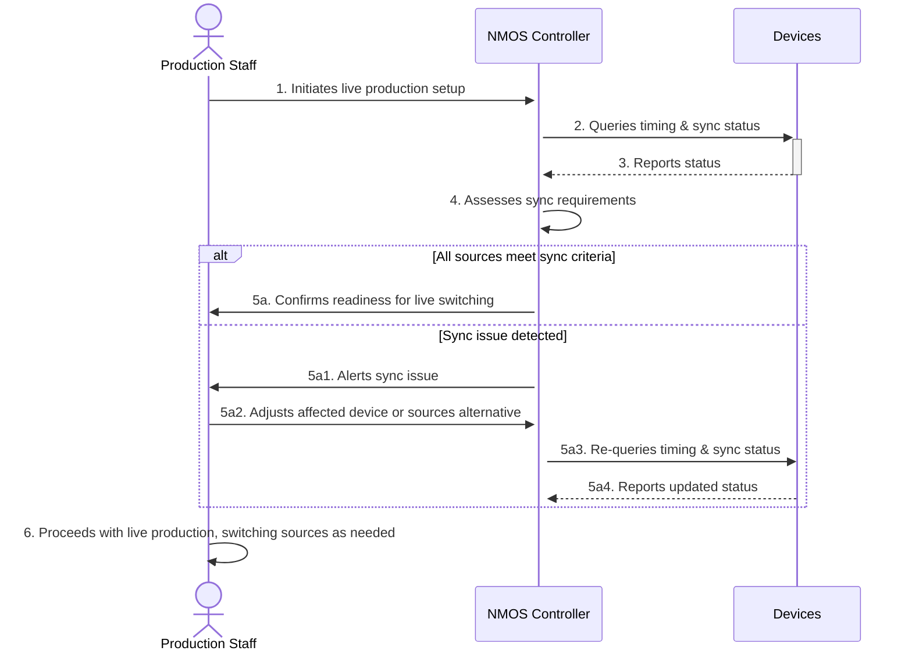

# Use Case: Live Production Switching

## Document Information

- **Document Title:** Live Production Switching Synchronization
- **Document Owner:** []
- **Version:** 1.0
- **Status:** Draft
- **Date:** [February 16 2024]

## 1. Brief Description

This use case describes the process of synchronizing multiple video and audio sources for seamless live switching in a production environment. It starts when the production is set up and ends when all sources are synchronized and ready for live switching.  

## 2. Actors

- **Production Staff:** Individuals responsible for managing and executing the live production.
- **NMOS Controller:** The system used to manage device connections and synchronization.

## 3. Pre-Conditions

- The production staff has logged into the NMOS Controller system.
- Video and audio sources are connected to the NMOS Controller.

## 4. Basic Flow

1. The production staff initiates the live production setup.
2. The NMOS Controller queries the timing modes and synchronization status of all connected devices.
3. Devices report their current timing and synchronization status to the NMOS Controller.
4. The NMOS Controller assesses the synchronization requirements based on the production setup.
5. If all sources meet the synchronization criteria, the NMOS Controller confirms readiness for live switching.
6. The production staff proceeds with live production, switching between sources as needed.

## 5. Alternate/Exception Flows

- **5a. Manual Synchronization Required:** If automatic synchronization fails:
    1. The NMOS Controller provides synchronization parameters to the production staff.
    2. The production staff manually adjusts the devices based on provided parameters.
    3. The process resumes at step 4.

## 6. Post Conditions

- All video and audio sources are synchronized according to the production requirements.
- The production staff can seamlessly switch between sources without noticeable lag or misalignment.

## 7. Supplemental Requirements

- **Security:** All interactions with the NMOS Controller must be authenticated to prevent unauthorized access.
- **Scalability:** The system must be capable of handling an increase in the number of sources without degradation in performance.

## 8. Visual Model

| Step | Description |
|------|-------------|
| 1    | Production Staff initiates live production setup. |
| 2    | NMOS Controller queries timing & sync status of devices. |
| 3    | Devices report their current timing and synchronization status. |
| 4    | NMOS Controller assesses synchronization requirements based on reported statuses. |
| 5a   | If all sources meet synchronization criteria, NMOS Controller confirms readiness for live switching. |
| 5b   | If a synchronization issue is detected, NMOS Controller alerts the Production Staff of the issue. |
| 6    | Production Staff adjusts the affected device or sources an alternative. |
| 7    | NMOS Controller re-queries timing & sync status of the adjusted devices. |
| 8    | Devices report their updated timing and synchronization status |
| 9    | Production Staff continues with their production tasks.

## Revision History

| V. | Date | Author | Description | Status |
|---|---|---|---|---|
| 1.0 | [February 16, 2024] | [Randy Godwin] | Initial creation of the live production switching synchronization use case. | Draft |
